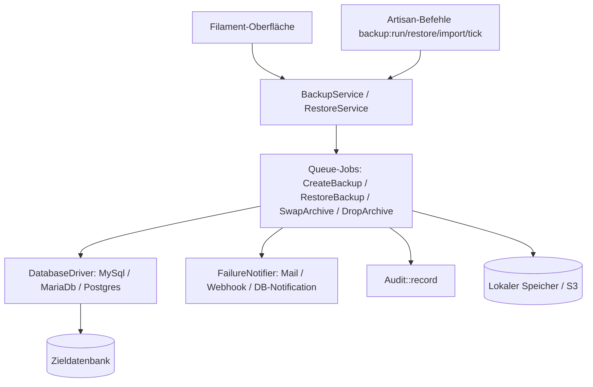

# Entwicklung

## Dev-Setup ohne lokales PHP

`docker/dev/Dockerfile` liefert PHP 8.4 CLI, Composer und dieselben Datenbank-Clients
(`mariadb-client`, `postgresql-client-18`) wie das Produktions-Image (`docker/Dockerfile`). In
`docker-compose.dev.yml` steht dafür ein Service `app` (Profil `tools`) zur Verfügung, im selben
Docker-Netzwerk wie die Fixtures; er mountet `laravel/` nach `/var/www/html`. Alle Befehle unten
laufen vom Repository-**Root** aus (dort liegt `docker-compose.dev.yml`):

```bash
docker compose -f docker-compose.dev.yml up -d          # Fixtures starten (MySQL, MariaDB, Postgres, MinIO, Mailpit)
docker compose -f docker-compose.dev.yml build app       # einmalig
docker compose -f docker-compose.dev.yml run --rm app composer install
docker compose -f docker-compose.dev.yml run --rm app composer test
docker compose -f docker-compose.dev.yml run --rm app composer test:integration
```

`docker-compose.dev.yml` ist ausschließlich für lokale Entwicklung/CI gedacht — alle Ports sind auf
`localhost` veröffentlicht, alle Zugangsdaten sind fest und öffentlich einsehbar.

## Fixtures

| Service | Zweck | Port |
|---|---|---|
| `mysql` | MySQL 8.4 | `13306` |
| `mariadb` | MariaDB 11.4 | `13307` |
| `postgres` | PostgreSQL 18 | `15432` |
| `minio` | S3-kompatibler Speicher | `19000` (API), `19001` (Konsole) |
| `mailpit` | SMTP-Testserver mit Weboberfläche | `11025` (SMTP), `18025` (Web) |

`DB_CONNECTION`/`DB_HOST`/… bzw. `BACKUP_S3_ENDPOINT` entsprechend auf diese Services zeigen lassen,
um lokal gegen eine echte Engine zu entwickeln.

## Tests

Zwei Testgruppen:

- **Standard** (`composer test`, Gruppe `default`): Unit- und Feature-Tests, laufen gegen SQLite
  im Speicher, keine externen Abhängigkeiten nötig.
- **Integration** (`composer test:integration`, Gruppe `integration`): laufen gegen die echten
  Datenbank-Fixtures oben (`docker-compose.dev.yml`) für alle drei Engines. Standardmäßig vom
  normalen Testlauf ausgeschlossen, da sie laufende Container voraussetzen.

Ein einzelnes Testfile gezielt ausführen:

```bash
docker compose -f docker-compose.dev.yml run --rm app php artisan test --filter=RestoreServiceTest
```

## Architektur



- **`laravel/app/Backup/Drivers/`** — `DatabaseDriver`-Interface mit einer Implementierung je Engine
  (`MySqlDriver`, `MariaDbDriver`, `PostgresDriver`), verantwortlich für `dump`/`import`/
  `createDatabase`/`dropDatabase`/`swap`/... `DriverFactory` wählt anhand `DB_CONNECTION` die
  passende Implementierung.
- **`laravel/app/Backup/`** — Orchestrierung: `BackupService`, `RestoreService`, `RetentionService`,
  `ArchiveNamer` (Namensschema und -validierung für Archive), `DumpValidator` (Sicherheitsprüfung
  hochgeladener Dumps), `OperationLock` (verhindert parallele datenverändernde Operationen).
- **`laravel/app/Jobs/`** — je ein Queue-Job pro Operation (`CreateBackupJob`, `RestoreBackupJob`,
  `SwapArchiveJob`, `DropArchiveJob`, `ValidateUploadedDumpJob`), jeweils mit `failed()`-Hook für
  Benachrichtigungen.
- **`laravel/app/Filament/`** — Resources, Pages, Actions und Widgets der Oberfläche.
- **`laravel/app/Support/`** — `Audit` (Audit-Log-Schreibzugriff), `FailureNotifier`.

## Eine weitere Datenbank-Engine ergänzen

1. Neue Klasse in `laravel/app/Backup/Drivers/`, die `DatabaseDriver` implementiert (an
   `AbstractMySqlFamilyDriver`/`PostgresDriver` orientieren, je nachdem welcher Familie die neue
   Engine näher ist).
2. In `DriverFactory::make()` eintragen.
3. In `laravel/app/helpers.php` (`target_database_connection()`) die passende Laravel-Connection-
   Konfiguration ergänzen.
4. `DumpValidator` um ein Erkennungsmuster für die neue Engine erweitern, falls sinnvoll.
5. Ein neues Dataset in den Integrationstests (`laravel/tests/Integration/Backup/`) sowie einen
   entsprechenden Fixture-Service in `docker-compose.dev.yml` ergänzen.

## Image und Releases

`.github/workflows/docker-image.yml` baut das Produktions-Image (`docker/Dockerfile`, Build-Kontext
= Repository-Root, nur `linux/amd64`) und veröffentlicht es auf der GitHub Container Registry unter
`ghcr.io/cooolinho/db-backup-management`. Lokal entspricht das:

```bash
docker build -f docker/Dockerfile -t db-backup:local .
```

| Auslöser | Tags |
|---|---|
| Push auf `main` | `latest`, `sha-<kurz>` |
| Git-Tag `v1.2.3` | `1.2.3`, `1.2`, `1`, `sha-<kurz>` |
| Pull Request auf `main` | nur Build zur Prüfung, kein Push |

Ein Release erfolgt über einen Git-Tag:

```bash
git tag v1.2.3
git push origin v1.2.3
```

**Sichtbarkeit des Pakets:** GitHub legt ein neu veröffentlichtes Package auf der Container
Registry standardmäßig **privat** an, auch wenn das Repository selbst öffentlich ist. Damit
`docker pull`/`docker run` auf einem Zielserver ohne vorheriges `docker login ghcr.io`
funktioniert, muss die Sichtbarkeit einmalig auf **Public** gestellt werden: auf GitHub unter
*Packages* → `db-backup-management` → *Package settings* → *Change visibility*.
